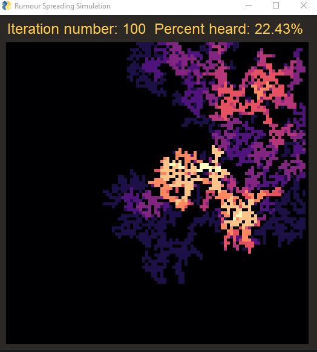
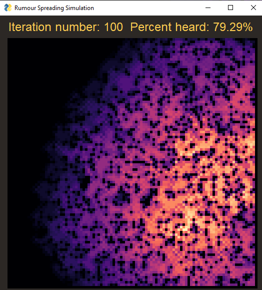

# Exercise 1 Report
*author* Alon Ravid

In this report I will analyse the spread of rumours in a 100 by 100 cell matrix. The simulation works iteritavly, starting with a random cell who decided to spread a rumour.

## Table of Contents
1. [Parameters](#parm)
2. [Iteration Step](#it)
3. [Initial Analysis](#init)
4. [Statistical Analysis](#sat)

## Parameters 
The simulation is defined by the following parameters:
* P - portion of the cells that are inhibited.
* L - spread limiter, after spreading the rumour a cell cannot spread it again for L iterations.
* Suciptibilty level ratios - defined in the parameters s1, s2, s3 and s4, the parameters represent a distribution function whose values are 1, 2/3, 1/3, 0 respectively. The values represent the probabilty that a cell will believe a rumour and then spread it upon hearing it.
* Number of iterations - how many iterations the simulation will run.

## Iteration Step 
At the start of an iteration, the heard rumour counters are reset to 0 for each cell. Then, each cell who has decided to spread a rumour in the previous iteration spreads the rumour to the existing neighbors to his sides.

The spreader is then set to cooldown for several iterations as noted above, and his neighbors add 1 to the counter of how many times they have heard the rumour this iteration.

The next part of an iteration is going over each cell which has heard the rumour, and deciding if it believes it according to its susceptibilty level. If so, it will do so in the next iteration as noted above.

## Initial Analysis 
At first, before running the simulation many times with changing parameters, I tried manually running the simulation a handfull of times. I started with the arbitrary values of p=0.7, l=2, s1=0.3, s2=0.3, s3=0.2, s4=0.2 for 100 iterations. After multiple runs, the simulation consistently presented a very small spread that had completely stopped after between 5-20 iterations.

I then tried shifting the susceptibilty distribution left, setting the variables at s1=0.7, s2=0.15, s3=0.1, s4=0.05. The resulting spread is shown bellow:

Already this is a much better result in terms of spread capacity, as the rumour manages to spread throughout the lattice of cells rather than become quickly fade away.

To achieve a higher percentage cover I realised the portion of living cells needs to be increased, the result of using p=0.85 is:

Indeed the total spread appears to have increased, but it could also be that a 100 iterations is too much, or that this single result is unrepresentative. Due to the fact that the total spread is directly tied mostly to both portion of living cells, suceptibilty levels and total number of iterations, I have decided to fix the latter parameter for my analysis.

I will investigate the effects of changing the distribution of susceptibilty levels and portion of living cells on the total spread and rate of spread over 100 iterations.

## Statistical Analysis 
### Fixing P First
First I started by setting p to be 0.8, based on the initial analysis. I then ran the simulation with the parameter L=5, and the following sets of distributions of susceptibilty levels:
 