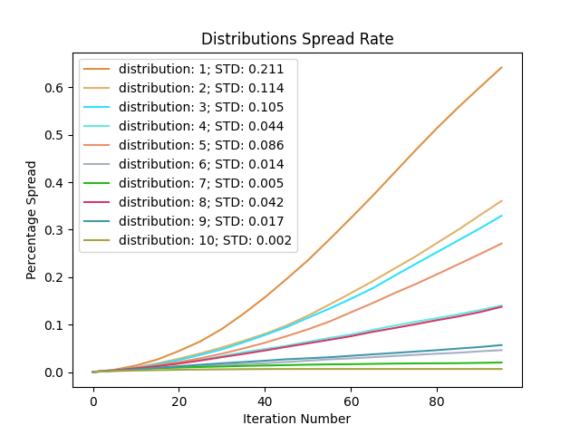
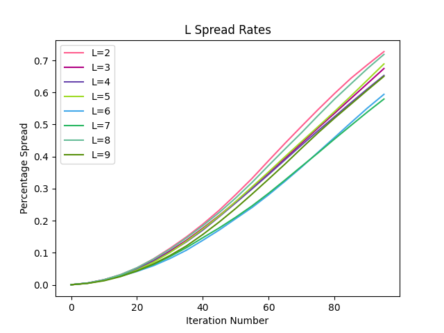
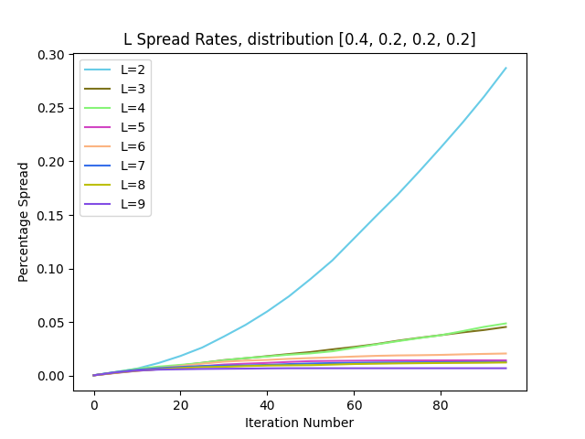
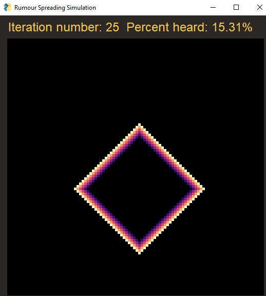
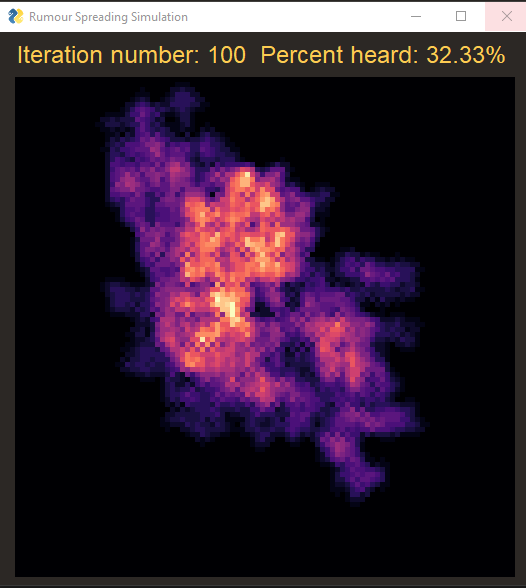
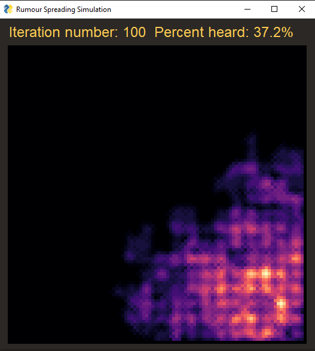

# Exercise 1 Report
*author* Alon Ravid

## Table of Contents
1. [Parameters](#parm)
2. [Iteration Step](#it)
3. [Initial Analysis](#init)
4. [Statistical Analysis](#sat)
5. [Strategic Simulation](#strat)

In this report I will analyse the spread of rumours in a 100 by 100 cell matrix by testing a range of parameters such as population density, chance of spreading, cooldown of spreading and more. 

The goal of the first two parts of the analysis is to find a set of parameters at which the spread of the rumour is not too fast, simply covering the entire lattice after a few dozen iterations, but not too slow as to fade or cover a small fraction of the lattice after 100.

The simulation works iteritavly, starting with a random cell who starts spreading a rumour to his adjacent neighbours above and bellow him, and to his left and right, without diagonal neighbours. Each cell who hears a rumour then needs to choose whether it spreads it or not, a desicion it makes based on its susceptibilty levels, with higher probabilty if it hears the rumour twice in one iteration.
The analysis is comprised of an initial part, where after I wrote the code for the simulation and created a GUI for inputing parameters and running it, I manually set different values for the parameters and played with it to get a sense of their effect on the spreading of the rumour.

The second part is a statistical analysis, where I fixed all parameters but one, for the variable parameter I set a range of values, and then ran the simulation in the background several times for each such value and took the average resulting spread at every 5 iterations.

I then plotted these average rates of spread per iteration number, i.e. the for some parameters and variable value I plotted the spread at iterations 5th, 10th and so on untill the 100th, looking for consistent trends.

The third part of the analysis is finding a strategy of placing cells of varying susceptibilty levels such that the rate of spread is slowed, but doesnt compeletly fade away.

 
\pagebreak 

## Parameters 
The simulation is defined by the following parameters:
* P - Portion of the cells that are inhibited.
* L - Spread limiter, after spreading the rumour a cell cannot spread it again for L iterations.
* Number of Iterations - How many iterations the simulation will run.
* Susceptibilty Level Ratios - Each cell has a susceptibilty level between 1 to 4, where S1 means it will spread every rumour it hears, S2 means it will spread it with probabilty of 2/3, S3 with probabilty of 1/3 and 4 with probabilty of 0. The parameters S1 to S4 determine the ratio of cells with the respective susceptibilty level.

In addition to the required parameters, I added several types of visualisations types, of which I used the "Times Rumour Heard" for all visuals of the simulation presented here except for one:
* Spread Cooldown - Color cells by how many iterations remain until it can spread the rumour again. A cell which spreads the rumour becomes bright and fades until it can spread it again.
* Rumour Heard - Colors cells by whether or not they have heard the rumour.
* Times Rumour Heard - Colors cells by how many times they have heard the rumour throughout the simulation. The brighter they are, the more times relative to the others they have heard the rumour.
* None - the simulation will run in the background and only present the last frame when it finishes.

## Iteration Step 
At the start of each iteration, each cell's counter for how many times it has heard the rumour is set to 0. Then, the simulation goes over each cell, checking if its cooldown counter is equal to L. If it is, it indicates that the cell decided to spread a rumour in the previous iteration, and will now spread it to any of its existing neighbors to his sides, increasing their counter for how many times they heard the rumour by one.

Then, after going over all spreading cells, the simulation goes over each cell which has heard the rumour, and decides if it spreads it. It does so by first checking if its cooldown counter is 0. If so, a random number between 0 and 1 is generated, and if it is less than the current cell's susceptibilty value, it will decide to spread the rumour. If the cell has heard the rumour at least twice, it will add 1/3 to the susceptibilty value, making it more likely to spread it. If it decides to spread the rumour, it will do so in the next iteration as noted above.

A cell which has decided to spread the rumour has its cooldown set to L, and in the next iteration it will be used to indiacate that this cell decided to spread the rumour. The resulting lattice can then be recorded, and the statistics of the rumour spread be collected.

## Initial Analysis 
At first, before running the simulation many times with changing parameters, I tried manually running the simulation a handfull of times. I started with the arbitrary values of p=0.7, l=2, s1=0.3, s2=0.3, s3=0.2, s4=0.2 for 100 iterations. After multiple runs, the simulation consistently presented a very small spread that had completely stopped after between 5-20 iterations. With p=0.9 the rumour managed to spread for about 30 iterations and through about 10% of the population, but those results were unsatisfactory.

 
\pagebreak 

I then tried shifting the susceptibilty distribution left, setting the variables at s1=0.7, s2=0.15, s3=0.1, s4=0.05. The resulting spread is shown bellow:

Already this is a much better result in terms of spread capacity, as the rumour manages to spread throughout the lattice of cells rather than become quickly fade away or becoming trapped in a small area due to dead cells and less susceptible cells.

 
\pagebreak 

To achieve a higher percentage cover, I concluded that the portion of living cells needs to be increased, the result of using p=0.85 is:

Indeed the total spread appears to have increased, but it could also be that a 100 iterations is too much, or that this single result is unrepresentative. Due to the fact that the total spread is directly tied mostly to both portion of living cells, suceptibilty levels and total number of iterations, I have decided to fix the latter parameter for my analysis.

After doing so, will investigate the effects of changing the distribution of susceptibilty levels and the cooldown factor L on the total spread and rate of spread over 100 iterations.

 
\pagebreak 

## Statistical Analysis 
### Fixing P and L
First I started by setting p to be 0.8, based on the initial analysis. I then ran the simulation 15 times with the parameter L=5, and a series of distributions of susceptibilty levels, taking the average spread at every 5 iterations. The series began at s1=0.7, s2=0.15, s3=0.1, s4=0.05 and ended with s1=0.3, s2=0.25, s3=0.25, s4=0.2, with each distribution in between shifting more the the center, represented by lower values of STD.

The results are presented in the following graph:

 
### Fixing P and Susceptibilty levels
I first fixed the susceptibilty levels to the first distribution as written above, with the intent of seeing how the L parameter affects the distribution's high spread rate.

 
\pagebreak 

The results are presented in the following graph:

The graph clearly shows that for a distribution with a high spread rate the L parameter's effect is quite small. Following this result, I ran the simulation similarly as above, 15 times taking the average, sampling the spread every 5 iterations. This time I ran it with the distribution [0.4, 0.2, 0.2, 0.2], whose spread was almost linear.

The results shows a much greater effect of L on the spread rate, with L=3 and L=4 show a linear spread of the rumour. L values above 4 show stagnation of spread, meaning at those levels the rumour stops spreading quickly.

Using this data, I have determined that a reasonable set of parameters with the fixed p=0.8, is a distribution of susceptibilty levels of s1=0.7, s2=0.15, s3=0.1, s4=0.05, and L=6. The result is shown in the first graph of L Spread Rates, coming at about 50% spread at the end, with the most mild rate of increase.

As a note, due to the fact that throughout the graphs each curve appears to have a consistent increase in spread, the chosen number of iterations appears to be a valid choice for investigating the simulation. If some graphs had shown inconsistent increases I would have revised this section, trying to also change the number of iterations parameter.

 
\pagebreak 

## Strategic Simulation 
The next part of the report will deal with strategies for placing cells of different susceptibilty levels, instead of randomly assigning them, and searching for a strategy which significantly slows down the spread of rumours. 

The parameters for this type of simulation are p=1, meaning all cells are occupied, since otherwise any strategic structures of cells might not work simply due to missing cells. In addition, I will be using L=5 like before.

The initial strategy I tested was simply to check that everything works as intended - all cells were set to have a susceptibilty level of 1. 

I expected to simply see if the strategic placement worked or not, but to my suprise I discovered an interesting behaviour, where the rumour spreads like a wave, without ever tracing back. This is due to the fact that once each cell has spread the rumour, the cells to his sides except for the ones in the wave's direction have spread the rumour recently and cannot pass it again to the back.

The wave at 25 iterations looks like this:

Where the "colder" dots represent a lower cooldown until the rumour can be spread again.
This result informed me that a good rumour, which doesnt spread too fast but doesnt fade away, must be contained in an asymetrical area, or one with different types of susceptibilty levels to prevent the synchronised movement and thus lack of ignition of the rumour.

I decided that a fitting solution would be creating 5 by 5 cell blocks of s1 cells, which enable the rumour to quickly spread without fading, with a column of s3, s3, s2, s3, s3 cells, which have a lower probabilty of passing the rumour to the next block, allowing it to propegate but prevents the synchronising of blocks and thus preventing the rumour from fading.

The result of this strategy with 100 iterations:

 
\pagebreak 

The result of this strategy with 300 iterations:

clearly in these examples, the rumour spread was much slower and relatively contained.
After running this 20 times,the average strategic simulation runs end with about 8% spread.
This is very slow, and I had made another attempt to create a similar but slightly faster strategy.

In this new strategy I set the blocks of susceptibilty values of 1 to be 4 on 4, with paddings of 2/3 completing to 5 by 5 blocks. In this strategy the average spread had become quite high at 84.186%. Another attempt was made, switching the 4th column and row of the block to also be 2/3, which yielded a final spread of 76.058%.

Finally, by turning all cells after the 3rd to be of value 1/3, I got an average spread of 28.7055. When visiualising the strategic simulation several additional times, I noticed that a couple of times the rumour quickly faded, probably when it got stuck in several 1/3 cells, meaning this strategy has a small chance to not spread the rumour at all. This risk is irrelevant if the initial spreader cell can be chosen. 

 
\pagebreak 

An example for a simulation of this strategy:

The blocks can be seen quite clearly, as well as the darker buffer zones with lower susceptibilty values. 