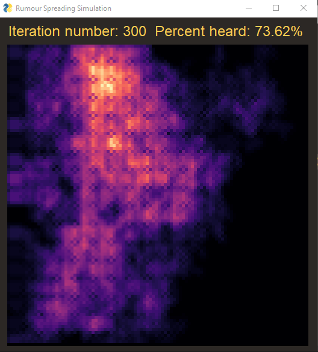

# Exercise 1 Report
*author* Alon Ravid

In this report I will analyse the spread of rumours in a 100 by 100 cell matrix. The simulation works iteritavly, starting with a random cell who decided to spread a rumour.

## Table of Contents
1. [Parameters](#parm)
2. [Iteration Step](#it)
3. [Initial Analysis](#init)
4. [Statistical Analysis](#sat)
5. [Strategic Simulation](#strat)

## Parameters 
The simulation is defined by the following parameters:
* P - portion of the cells that are inhibited.
* L - spread limiter, after spreading the rumour a cell cannot spread it again for L iterations.
* Suciptibilty level ratios - defined in the parameters s1, s2, s3 and s4, the parameters represent a distribution function whose values are 1, 2/3, 1/3, 0 respectively. The values represent the probabilty that a cell will believe a rumour and then spread it upon hearing it.
* Number of iterations - how many iterations the simulation will run.

## Iteration Step 
At the start of an iteration, the heard rumour counters are reset to 0 for each cell. Then, each cell who has decided to spread a rumour in the previous iteration spreads the rumour to the existing neighbors to his sides.

The spreader is then set to cooldown for several iterations as noted above, and his neighbors add 1 to the counter of how many times they have heard the rumour this iteration.

The next part of an iteration is going over each cell which has heard the rumour, and deciding if it believes it according to its susceptibilty level. If so, it will do so in the next iteration as noted above.

## Initial Analysis 
At first, before running the simulation many times with changing parameters, I tried manually running the simulation a handfull of times. I started with the arbitrary values of p=0.7, l=2, s1=0.3, s2=0.3, s3=0.2, s4=0.2 for 100 iterations. After multiple runs, the simulation consistently presented a very small spread that had completely stopped after between 5-20 iterations.

I then tried shifting the susceptibilty distribution left, setting the variables at s1=0.7, s2=0.15, s3=0.1, s4=0.05. The resulting spread is shown bellow:

Already this is a much better result in terms of spread capacity, as the rumour manages to spread throughout the lattice of cells rather than become quickly fade away.

To achieve a higher percentage cover I realised the portion of living cells needs to be increased, the result of using p=0.85 is:

Indeed the total spread appears to have increased, but it could also be that a 100 iterations is too much, or that this single result is unrepresentative. Due to the fact that the total spread is directly tied mostly to both portion of living cells, suceptibilty levels and total number of iterations, I have decided to fix the latter parameter for my analysis.

After doing so, will investigate the effects of changing the distribution of susceptibilty levels and the cooldown factor L on the total spread and rate of spread over 100 iterations.

## Statistical Analysis 
### Fixing P and L
First I started by setting p to be 0.8, based on the initial analysis. I then ran the simulation 15 times with the parameter L=5, and a series of distributions of susceptibilty levels, taking the average spread at every 5 iterations. The series began at s1=0.7, s2=0.15, s3=0.1, s4=0.05 and ended with s1=0.3, s2=0.25, s3=0.25, s4=0.2, with each distribution in between shifting more the the center, represented by lower values of STD.

The results are presented in the following graph:

 
### Fixing P and Susceptibilty levels
I first fixed the susceptibilty levels to the first distribution as written above, with the intent of seeing how the L parameter affects the distribution's high spread rate.
The results are presented in the following graph:

The graph clearly shows that for a distribution with a high spread rate the L parameter's effect is quite small. Following this result, I ran the simulation similarly as above, 15 times taking the average, sampling the spread every 5 iterations. This time I ran it with the distribution [0.4, 0.2, 0.2, 0.2], whose spread was almost linear.

The results shows a much greater effect of L on the spread rate, with L=3 and L=4 show a linear spread of the rumour. L values above 4 show stagnation of spread, meaning at those levels the rumour stops spreading quickly.

Using this data, I have determined that a reasonable set of parameters with the fixed p=0.8, is a distribution of susceptibilty levels of s1=0.7, s2=0.15, s3=0.1, s4=0.05, and L=6. The result is shown in the first graph of L Spread Rates, coming at about 50% spread at the end, with the most mild rate of increase.

As a note, due to the fact that throughout the graphs each curve appears to have a consistent increase in spread, the chosen number of iterations appears to be a valid choice for investigating the simulation. If some graphs had shown inconsistent increases I would have revised this section, trying to also change the number of iterations parameter.

## Strategic Simulation 
The next part of the report will deal with strategies for placing cells of different susceptibilty levels, instead of randomly assigning them, and searching for a strategy which significantly slows down the spread of rumours. 

The parameters for this type of simulation are p=1, meaning all cells are occupied, since otherwise any strategic structures of cells might not work simply due to missing cells. In addition, I will be using L=5 like before.

The first strategy I tested was a test strategy - all cells have susceptibilty level of 1. I only expected to see if the strategic placement worked or not, but to my suprise I discovered an interesting behaviour, where the rumour spread exactly like a wave, without ever tracing back. This is due to the fact that once each cell has spread the rumour, the cells to his sides except for the wave direction have spread the rumour recently and cannot pass it again to the back.

The wave at 25 iterations looks like this:

where the "colder" dots represent a lower cooldown until the rumour can be spread again.
This result informed me that a good rumour, which doesnt spread too fast but doesnt fade away, must be contained in an asymetrical area, or one with different types of susceptibilty levels to prevent the synchronised movement and thus lack of ignition of the rumour.

I decided that a fitting solution would be creating 5 by 5 cell blocks of s1 cells, which enable the rumour to quickly spread without fading, with a column of s3, s3, s2, s3, s3 cells, which have a lower probabilty of passing the rumour to the next block, allowing it to propegate but prevents the synchronising of blocks and thus preventing the rumour from fading.

The result of this strategy with 100 iterations:

The result of this strategy with 300 iterations:

clearly in these examples, the rumour spread was slow and relatively contained.
After running this multiple times manually, it seems most strategic simulation runs end with about 23% spread.